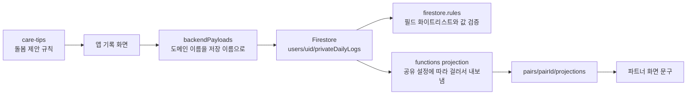

# ADR-0005: 컨디션 기록의 감정 축 신설과 중복 축 제거

## 상태

Accepted · 2026-09-20 · 미해결 질문 3건 확정 · 2026-09-20 호환 계층 제거로 개정

2026-09-20 개정: 미출시 상태를 근거로 `mood`/`moodTag` 의 호환 유지를 철회하고 전면 제거로 바꿨다. prod 테스트 기록 11건은 삭제했다. 개정 전 결정은 아래 「기각된 초안」에 남긴다.

## 배경

하루 기록이 7필드다. `bleeding`, `symptoms`, `mood`, `energy`, `condition`, `helpPreferences`, `note`. 매일 채우기에 무겁고, 그중 세 축이 서로 겹친다.

```ts
mood?:      "very-low" | "low" | "neutral" | "good" | "very-good"   // 5단계 척도
energy?:    1 | 2 | 3 | 4 | 5                                        // 5단계 척도
condition?: comfortable | tired | low-energy | cramps | headache | sensitive | needs-space | other
```

- `tired`, `low-energy` 는 `energy` 와 같은 것을 묻는다
- `sensitive` 는 `mood` 와 같은 것을 묻는다
- **감정은 좋다/나쁘다 방향만 있고 "어떤 감정인지"가 없다**

마지막 항목이 이 ADR 의 출발점이다. 이 앱은 파트너가 상대의 상태를 알고 돌보라고 만든 것인데, 정작 "불안한지 서운한지 외로운지"를 담을 자리가 없다. `helpPreferences`(들어주기·혼자 있기·따뜻하게·밥 챙기기·일정 조정·실질적 도움·안부·아무것도)는 이미 잘 만든 돌봄 축이므로, 비어 있는 것은 감정 축 하나다.

## 조사 결과

### 도메인 이름과 저장 이름이 다르다

| 도메인 `models.ts` | 저장·전송 |
| --- | --- |
| `mood` | `moodTag` |
| `energy` | `energyLevel` |
| `condition` | `conditionCode` |
| `helpPreferences` | `carePreferences` |
| `symptoms` | `symptomTags` |

매핑은 `apps/mobile/src/platform/backend/backendPayloads.ts` 에 있다. **도메인 타입 이름을 바꿔도 저장 스키마는 따라오지 않는다.** 두 층을 따로 설계해야 한다.

### prod 데이터는 11건이고 전부 내부 테스트 데이터다

2026-09-20 `seorilabs-cyclepair-prod` 집계다. 기록 내용은 읽지 않고 필드 보유 수와 값 분포만 집계했다.

```
사용자(하위 문서 보유)  8명
privateDailyLogs       11건      privateCycles  7건
schemaVersion          전부 2

moodTag        neutral 6 · low 2 · very-good 1 · very-low 1 · good 1
conditionCode  comfortable 4 · tired 3
energyLevel    3:5 · 2:3 · 4:1
```

이 앱은 아직 공개 출시 전이다. Google Play 내부 테스트와 TestFlight 만 있다. 위 11건은 2026-09-20 에 삭제했다. D4 참조.

### 닿는 범위는 34개 파일이다

경계를 넘는 지점이 중요하다.



- `firebase/firestore.rules` 158~192행: 허용 필드 목록과 값 열거
- `firebase/functions/src/domain/projection.ts`: `moodTag`·`energyLevel`·`conditionCode`·`carePreferences` 를 공유 설정으로 걸러 내보낸다
- `apps/mobile/src/app/partnerProjectionPresentation.ts`: `moodCopy` 로 파트너 문구를 만든다
- `packages/product-core/src/domain/sharing.ts`: `SHAREABLE_FIELDS` 에 `mood`·`condition` 이 있다
- `packages/product-core/src/domain/care-tips.ts`: `match.conditions` 에 `tired`·`low-energy` 를 쓴다

## 결정

### D1. 감정 축을 신설한다

`mood`(5단계 척도)를 대체하는 `emotion`(감정 코드)을 만든다. 저장 필드는 `emotionTag` 다.

값은 긍정과 부정을 균형 있게 담고, 진단이나 의학적 단정을 하지 않는 중립 어휘를 쓴다. 9개로 확정한다.

| 코드 | 한국어 |
| --- | --- |
| `calm` | 평온 |
| `happy` | 기쁨 |
| `affectionate` | 애정 |
| `anxious` | 불안 |
| `irritable` | 예민 |
| `hurt` | 서운 |
| `lonely` | 외로움 |
| `drained` | 지침 |
| `other` | 그 외 |

`drained`(지침)는 `energy` 와 겹쳐 보이지만 다른 것을 묻는다. `energy` 는 몸의 기력이고 `drained` 는 마음의 소진이다. 몸은 멀쩡한데 마음이 지치는 상태가 실재하므로 둘 다 둔다.

**다중 선택을 허용한다.** 감정은 여러 개가 동시에 성립한다. 불안하면서 서운할 수 있다. 저장은 문자열 배열이며 상한은 3개로 둔다. 상한을 두는 이유는 전부 고르면 아무 정보도 되지 않기 때문이다.

`other` 를 고른 경우 `note` 로 이어지게 한다. 별도 자유 입력 필드를 만들지 않는다.

### D2. 중복 축을 제거한다

`energy`(1~5)는 그대로 둔다. `ConditionCode` 에서 `tired`·`low-energy`·`sensitive` 를 뺀다. 남는 값은 `comfortable`·`cramps`·`headache`·`needs-space`·`other` 로, 몸 상태만 남는다.

`care-tips` 의 `match.conditions: ["tired", "low-energy"]` 규칙은 `energy <= 2` 조건으로 옮긴다. 같은 의도를 중복 없이 표현한다.

### D3. 기본 화면은 두 가지만 묻는다

`지금 마음`(감정)과 `뭐가 필요해요?`(돌봄) 둘만 기본 노출한다. 생리·증상·기력·메모는 접어 둔다. 하루 기본 입력이 7필드에서 2필드가 된다.

필드를 지우는 것이 아니라 **기본 노출을 줄이는 것**이다. 기록하고 싶은 사람은 펼쳐서 다 쓸 수 있다.

### D4. 테스트 기록을 삭제한다

이 앱은 공개 출시 전이다. prod 의 `privateDailyLogs` 11건은 전부 내부 테스트 데이터였다. 2026-09-20 에 백업 후 삭제했다.

```
삭제 완료 11건, 실패 0건
삭제 후: privateDailyLogs 0 · privateCycles 7 · privateDailyLogTombstones 0
파트너 projection: 일일기록 필드 없음 (트리거가 정리)
```

동의 기록인 `privateCycles` 7건은 남겼다. 지우면 민감정보 동의가 풀려 재동의가 필요해지는데, 얻을 것이 없다.

**마이그레이션을 설계하지 않는다.** 옮길 데이터가 없다. ADR-0004 의 "미출시 개발 데이터는 초기화하고, 실제 사용자 데이터 마이그레이션은 수행하지 않는다"를 그대로 따른다.

### D5. `mood` 와 `moodTag` 를 전면 제거한다

도메인 타입, 저장 필드, 규칙 화이트리스트, projection, 파트너 문구에서 모두 없앤다. `emotion` / `emotionTag` 가 자리를 대신한다.

호환을 위해 남기지 않는다. 미출시 앱에 구버전 호환 계층을 두는 것은 나중에 걷어낼 부채를 스스로 만드는 일이다.

**규칙 화이트리스트에서 필드를 뺄 때의 함정을 기록해 둔다.** Firestore 규칙의 `request.resource.data` 는 쓰기 후 문서 전체다. 기존 문서에 해당 필드가 남아 있으면, 새 클라이언트가 그 필드를 건드리지 않고 merge 업데이트만 해도 `hasOnly` 검사에 걸려 거부된다. 즉 **화이트리스트에서 빼려면 기존 문서에서도 그 필드가 없어야 한다.** 이번에는 문서를 통째로 지워 해소했다.

### D6. 공유 경계를 같이 바꾼다

- `SHAREABLE_FIELDS` 의 `mood` 를 `emotion` 으로 바꾼다
- `firestore.rules` 화이트리스트에 `emotionTag` 와 허용 값을 추가한다
- `projection.ts` 가 공유 설정에 따라 `emotionTag` 를 내보내게 한다
- 파트너 문구를 감정 코드별로 추가한다

**가임 정보 역추론 검토.** #48 에서 배란기 값이 필드 존재 여부로 새어 나가지 않도록 접는 규칙을 세웠다. 감정 값은 주기 위상을 역추론하게 하지 않으므로 접기 대상이 아니다. 다만 `emotionTag` 도 다른 필드와 똑같이 **날짜와 무관하게 필드 존재 여부가 일정해야 한다**는 불변식은 지킨다.

### D7. 감정 기본 공유는 꺼진 상태로 시작한다

현재 공유 설정 기본값은 비공개다. `emotion` 도 같다. 파트너에게 보이게 하려면 사용자가 켜야 한다.

## 결과

- 하루 기본 입력 7필드 → 2필드
- 중복 축 세 개 제거, 각 축이 하나의 질문만 담는다
- 감정이라는 빈 자리가 채워져 돌봄 제안이 실제 감정에 반응할 수 있다
- 호환 계층이 남지 않는다. `mood` 를 나중에 걷어낼 부채로 끌고 가지 않는다
- 기존 기록이 없으므로 두 형식이 공존하는 기간도 없다
- 기기에 남아 있던 내부 테스트 기록은 사라진다. 다음 실행에서 빈 상태로 시작한다

## 대안과 기각 사유

**A1. `mood` 값을 감정으로 기계 변환한다** — 기각. 복원 불가능한 정보를 지어내는 것이다.

**A2. 기존 기록을 보존한 채 감정 축만 추가한다** — 기각. 보존하면 `moodTag` 를 규칙 화이트리스트에 남겨야 하고, 그러면 미출시 앱에 구버전 호환 계층이 생긴다. 걷어낼 대상이 없는데 부채만 남는다. 「기각된 초안」 참조.

**A3. `mood` 를 두고 감정을 추가한다** — 기각. 입력 부담이 늘고, 애초에 문제였던 중복 축이 하나 더 늘어난다.

**A4. `moodTag` 를 `emotionTag` 로 in-place rename 한다** — 기각. 타입이 다르다. `moodTag` 는 단일 문자열이고 `emotionTag` 는 문자열 배열이다. 이름만 바꾸면 값이 맞지 않는다.

## 확정된 질문

세 가지 모두 2026-09-20 에 정했다.

1. **감정 코드 목록** — 9개로 확정. `평온`·`기쁨`·`애정`·`불안`·`예민`·`서운`·`외로움`·`지침`·`그 외`. D1 참조
2. **다중 선택** — 허용. 최대 3개. D1 참조
3. **`moodTag` 제거 시점** — 이번 구현에서 전면 제거. 미출시라 호환을 유지할 대상이 없다. D5 참조

## 남은 위험

**`emotionTag` 는 배열이라 규칙 검증이 `moodTag` 보다 까다롭다.** 값 열거, 길이 상한, 중복 금지를 모두 규칙에서 막아야 한다. `symptomTags` 가 이미 같은 형태로 검증되고 있으므로 그 패턴을 따른다.

**파트너 문구가 조합으로 늘어난다.** 감정 3개까지 선택되면 문구 경우의 수가 커진다. 문구를 조합으로 만들지 말고 감정별 단문을 나열하는 방식으로 간다. 진단이나 해석을 덧붙이지 않는다.

## 기각된 초안

초안은 `moodTag` 를 규칙 화이트리스트에 남겨 구버전 앱의 쓰기를 계속 받자고 했다. 근거는 2026-09-19 의 장애였다. 배포된 규칙에 `privateDailyLogTombstones` 블록이 없어 tombstone 쓰기가 영구 거부됐고, Keychain 오프라인 큐에 남은 그 하나가 쓰기 스트림 전체를 막았다.

**기각한다.** 메커니즘은 실재하지만 이 앱에는 적용되지 않는다. 공개 출시를 하지 않았고 구버전을 쓰는 외부 사용자가 없다. 없는 사용자를 위해 호환 계층을 두는 것은 과설계다.

이 판단이 뒤집히는 조건은 하나다. **공개 출시 이후에는 같은 상황에서 호환 계층이 필요하다.** 그때는 구버전이 실제로 존재하고, 위 장애가 그대로 재현된다.
